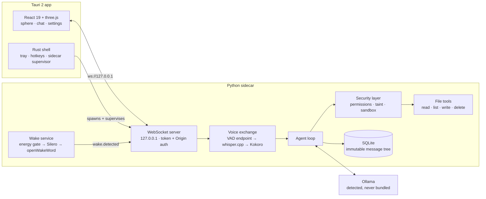

# JARVIS

**A local-first, voice-activated AI assistant that runs entirely on your own machine.**
Say *"Hey Jarvis"*, talk, get a spoken answer — no API keys, no account, no telemetry,
and no network traffic you didn't ask for.

[](https://github.com/AayushSharma1003/jarvis/actions/workflows/ci.yml)
[](LICENSE)


<!-- DEMO GIF: record "Hey Jarvis" → question → spoken answer, sphere reacting. -->

> **Status: pre-alpha, 3 of 6 phases complete, phase 4 underway.** The voice loop is real
> and works end to end on an 8 GB M2: wake word, endpointing, transcription, local LLM,
> streaming speech, barge-in, and an audio-reactive sphere. The permission engine, the
> filesystem sandbox and taint tracking are **built and enforcing**, with file tools on
> top of them; shell and `web_fetch` are still to come.
> [What works today](#what-works-today) is honest about the line.

---

## The interesting part

Everything below is measured on the primary target: an **8 GB M2 Pro MacBook**, the
machine this project is tuned for on the theory that if it's smooth there, it's smooth
anywhere.

| Metric | Measured | Why it's not free |
|---|---|---|
| Always-on wake word, idle CPU | **2.4%** of one core | An always-listening loop that costs 15% of a core is a laptop-battery bug wearing a feature costume. Budget was <3%. |
| End of speech → first audible word | **1.17–1.41 s** | Started at 3.92 s. The fix wasn't a faster model — see [latency.md](docs/latency.md). |
| Warm text time-to-first-token | **407 ms** | llama3.2:3b via Ollama. |
| Whisper transcription at endpoint | **~140 ms** | Whole utterance on Metal at the endpoint — measured fast enough that streaming STT was unnecessary complexity. |
| Sphere render cost | **1.8 ms CPU/frame** | ~6k shader-displaced points + bloom, with a behaviour-identical Canvas-2D fallback. |
| Backend test suite | **296 tests** | Voice orchestration included: a `VoiceIO` boundary lets the whole spoken turn be driven over the WebSocket with zero hardware and zero model files. |

Four decisions this project is actually about:

- **One ML runtime story.** onnxruntime (wake word, VAD, TTS) + whisper.cpp (STT).
  No PyTorch, no ctranslate2 — a dependency that drags a second 2 GB runtime into a
  desktop bundle is a regression, not a shortcut. The openWakeWord inference chain is
  [vendored](backend/jarvis_backend/wake/detector.py) (three ONNX sessions and a ring
  buffer, bit-exact against the reference implementation) specifically to keep scipy and
  scikit-learn out of the shipped sidecar.
- **Local-first is a constraint, not a marketing line.** Ollama is detected or installed,
  never bundled. The model catalog is bundled data with a *manual* refresh. There is no
  server, no auto-update, no crash reporter, no analytics. The app makes exactly the
  network calls you ask it to.
- **The security model was designed before the tools existed** ([security-model.md](docs/security-model.md)),
  because retrofitting a permission engine onto a shipped tool list is how assistants get
  their users owned by a web page.
- **Messages are an immutable tree from day one.** Turn-grouped, `parent_id`-linked,
  branching-ready — the branching *UI* is phase 5, but retrofitting immutability is the
  expensive half, so it was done first.

---

## What works today

| | Status | |
|---|---|---|
| **Text chat** | ✅ working | Streaming, stop/interrupt, conversation sidebar (list / switch / rename / delete), RAM-tier-aware model picker, a setup readiness gate, reconnect with backoff, full i18n. |
| **Voice loop** | ✅ working | Hotkey or wake word → Silero VAD endpointing → whisper.cpp (Metal) → local LLM → clause-chunked Kokoro TTS → playback with barge-in. |
| **"Hey Jarvis" always-on** | ✅ working | Vendored openWakeWord chain behind an adaptive energy gate + VAD, so the expensive embedding model sleeps in silence. Wake word also interrupts playback. |
| **The sphere** | ✅ working | Audio-reactive orb, four states, docks into the header while you chat and glides to centre stage when you speak. WebGL with a 2D fallback. |
| **Storage** | ✅ working | SQLite message tree, branching-ready. Delete is the one exception to immutability, by design. |
| **Permission engine** | ✅ working | `safe`/`ask`/`dangerous`, an in-app confirmation the *backend* requests (never a claim a client can make), "allow for this session" keyed on tool + exact arguments and never for `dangerous`, and every way of not getting an answer resolving to deny. |
| **Filesystem sandbox + taint** | ✅ working | Paths enforced after `resolve()`, Jarvis's own config/data excluded ahead of the root test; reading a file marks the conversation, and from there side-effectful calls confirm with provenance and can't be covered by a session grant. |
| **File tools** | ✅ working | `read_file` / `list_dir` (safe), `write_file` (ask), `delete_file` (dangerous, refuses directories). Tool use is gated on the model — unvetted models never see a schema. |
| **Shell + `web_fetch`** | 🚧 phase 4, not built | `run_command` and its always-confirm rule, and `web_fetch` with SSRF guards, are specified in [security-model.md](docs/security-model.md) and are the next two milestones. |
| **Extensions** | 🚧 phase 5 | Manifest-declared permissions, approved on load, running outside the sandbox. Designed, no loader yet. |
| **Installers** | 🚧 phase 6 | The release workflow already builds unsigned bundles for all three OSes on a tag. |

**Verified on macOS (Apple Silicon), hands-on.** Windows and Linux are built by CI every
tag and are *not* yet hands-on tested — the cross-platform code paths exist, the hardware
validation does not. Said plainly because a README that claims three platforms and has
tested one is a bug report waiting to be filed.

---

## How it works



The Rust shell spawns the Python sidecar with a token in its environment and waits for a
JSON ready-line on stdout; the webview then connects over a loopback WebSocket that
checks both the token and the `Origin` header. The sidecar watches its parent PID and
exits with it, so there are no orphaned Python processes.

**Where the 1.4 seconds go** (8 GB M2, llama3.2:3b — full breakdown in [latency.md](docs/latency.md)):

| Stage | Time |
|---|---|
| VAD hangover before the endpoint fires | 700 ms *(a perception tunable, reported separately)* |
| whisper.cpp on the whole utterance (Metal) | ~140 ms |
| LLM time to first sentence | ~500–650 ms |
| Kokoro first chunk | ~550–850 ms |
| Audio out | ~40 ms |

The chunking is the trick: waiting for a complete first sentence cost 3.0 s of synthesis
on a long opener, so TTS fires on the first clause or 10 words, whichever closes first,
and the voice-mode system prompt asks the model for a short opening sentence. Latency is
a prompt-engineering problem as much as an inference one.

---

## Security model, short version

Full write-up: **[docs/security-model.md](docs/security-model.md)** — normative, and
written before the code.

Built and enforcing today:

- Every tool carries a risk level: `safe` / `ask` / `dangerous`. Risky calls confirm with
  the exact action shown, the dialog defaults focus to **Deny**, and `dangerous` can be
  switched off wholesale (`[tools] allow_dangerous`) — off means refused without asking.
- Filesystem tools are sandboxed to user-chosen roots, enforced on `resolve()`-ed paths so
  a `..` or a symlink inside a root pointing out is refused. Jarvis's own config and data
  directories are excluded *before* the root test, so no tool can widen its own sandbox.
- **Taint tracking:** once untrusted content (today: a file Jarvis read) enters the
  conversation, every side-effectful call escalates to confirmation with provenance, and
  cannot be covered by — or create — an "allow for this session" grant. Prompt injection
  is assumed, not defended against by hope.
- The backend binds 127.0.0.1 with a per-session token and a strict `Origin` check.
- Tool use is gated on the *model*: one that can't reliably decline a tool manufactures
  permission dialogs, and confirmation fatigue is how permission engines fail.

Specified, not yet built — [security-model.md](docs/security-model.md) is normative and
these are the parts it is still ahead of the code on:

- **Shell always confirms**, full command text shown, no classifier and no denylist (both
  are bypass generators). `run_command` does not exist yet.
- `web_fetch` and its SSRF guards; extension manifests and the load-time approval gate.

---

## Run it from source

Prereqs: [uv](https://docs.astral.sh/uv/), Node 22+, Rust stable, and
[Ollama](https://ollama.com) running with a model pulled (`ollama pull llama3.2:3b`).

```sh
# backend: deps, tests, and a setup diagnosis
cd backend && uv sync && uv run pytest && uv run jarvis doctor

# voice models (~500 MB, pinned URLs + SHA-256, resumable) — user-invoked, never automatic
uv run python ../scripts/fetch_models.py

# the app
cd ../app && npm install && npm run tauri dev
```

`uv run jarvis doctor --latency` runs the real voice pipeline against a synthetic
utterance — Kokoro speaks the test question, so no microphone is needed — and prints the
per-stage breakdown above for your machine.

There are no installers yet. When there are, they will be **unsigned**: this is a
zero-budget project and code-signing certificates are not free. The OS warnings you'd see
and why are documented in [unsigned-install.md](docs/unsigned-install.md) rather than
hand-waved.

---

## Engineering notes

The things that cost real time, kept so nobody rediscovers them:

- **CPU% lies on Apple Silicon.** A mostly-idle background thread gets scheduled onto
  efficiency cores at roughly a third of the clock, so the same work reads ~3× the CPU%
  you measured in a hot benchmark loop. Always-on budgets have to come from measured idle
  deltas, not from hot-loop arithmetic.
- **int8 Kokoro is 2.4× *slower* than fp32** on Apple Silicon (RTF 0.66 vs 0.28), and the
  CoreML execution provider fragments the graph into 155 partitions. Both "optimisations"
  were tried and reverted.
- **WKWebView suspends the WebContent process** when the window is occluded — frozen JS
  can't answer a wake event, while WebKit's separate networking process keeps the
  WebSocket `ESTABLISHED` so everything *looks* healthy. Always-on means the webview has
  to be told not to throttle.
- **Whisper transcribes silence as `[BLANK_AUDIO]`**, which is a non-empty string, which
  became a real LLM turn. Ambient room noise was starting conversations.
- **UnrealBloom writes alpha = 1**, turning a transparent canvas into an opaque square;
  the sphere's edges dissolve via an in-scene vignette that fades to the exact page
  background instead. And the render watchdog measures *render-call duration*, never
  frame cadence — rAF throttling makes cadence lie and will happily demote a perfectly
  capable GPU to the 2D fallback forever.
- **Tauri 2 needs an explicit capabilities file** or the webview gets zero IPC permissions
  and `event.listen` fails silently — which presents as "the backend didn't start".

- **A model that can't decline a tool is a security problem, not a quality one.**
  llama3.2:3b answers "what's 17 times 4?" by running `echo 17*4` in a shell, 3 times
  out of 3. Every spurious call is a permission dialog the user didn't provoke, and
  confirmation fatigue is the documented way permission engines fail. Tool use is
  therefore gated on the model, and unvetted models default to off —
  [with measurements](docs/tool-calling.md).

More: [architecture.md](docs/architecture.md) · [latency.md](docs/latency.md) ·
[tool-calling.md](docs/tool-calling.md) · [docs/design/sphere.md](docs/design/sphere.md)

---

## Repo layout

| Path | What lives there |
|---|---|
| [app/](app/) | Tauri 2 shell (`src-tauri/`) + React/TypeScript frontend — sphere, chat, settings |
| [backend/](backend/) | Python sidecar: `wake` `stt` `tts` `llm` `agent` `tools` `security` `storage` `server` |
| [extensions/](extensions/) | Manifests for the default extension set — the loader is phase 5, so the bodies are still empty |
| [scripts/](scripts/) | Installers, PyInstaller sidecar build, model fetch, offline wake-word training |
| [catalog/](catalog/) | Curated model catalog — bundled data, manual refresh, not a service |
| [docs/](docs/) | Architecture, security model, latency budgets, extension authoring |

Backend emits machine-readable error **codes**; every user-facing string lives in
`app/src/i18n/`. That rule is enforced in review — it's what makes translation a data
problem later instead of a refactor.

---

## Roadmap

1. ✅ **Walking skeleton** — Tauri shell + sidecar + streaming text chat + SQLite tree.
2. ✅ **Voice loop** — VAD, whisper.cpp, Kokoro, barge-in, inside the latency budget.
3. ✅ **Always-on + feel** — wake word, sphere, chat management, readiness gate, RAM tiering.
4. 🚧 **Agency + security** — tools ship *with* their security layer, never before it. Done: the [model capability gate](docs/tool-calling.md) (tool use is gated on the model, because *"can this model decline a tool?"* turns out to be a security property), the tool plumbing, the permission engine + confirmation, and the filesystem sandbox + file tools + taint. Next: shell, then `web_fetch` + SSRF.
5. **Extended scope** — branch navigation UI, `jarvis install <url>`, model catalog UI, custom wake words.
6. **Ship** — installers, docs, a tagged unsigned release with checksums.

Post-v1: acoustic echo cancellation (macOS Voice Processing AU, then WebRTC AEC3), voice
cloning evaluation, and auto-update if signing ever becomes affordable.

---

## Contributing

[CONTRIBUTING.md](CONTRIBUTING.md). Extensions are the intended entry point; anything
touching `backend/jarvis_backend/security/` wants an issue first.

## License

[Apache-2.0](LICENSE). Third-party models and vendored code are credited in
[NOTICE](NOTICE) — openWakeWord, Silero VAD, whisper.cpp and Kokoro, without which none
of this would run on a laptop.

No model weights live in this repository; `scripts/fetch_models.py` downloads them from
upstream on request. One caveat worth stating up front: openWakeWord's **pre-trained wake
models are CC BY-NC-SA 4.0** (non-commercial), a constraint that belongs to those
downloaded weights rather than to JARVIS. `scripts/train_wake_word.py` trains a
replacement offline for anyone who needs to be clear of it.
