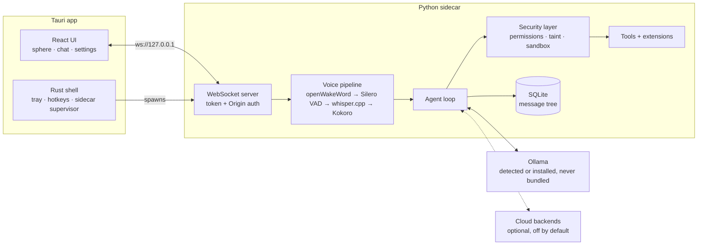

# Architecture

> Status: approved design, pre-implementation. Diagram to be refined as code lands.

## Load-bearing decisions

- **One ML runtime story**: onnxruntime (wake word, VAD, Kokoro) + whisper.cpp (Metal/CUDA/CPU). No PyTorch, no ctranslate2.
- **Sidecar is PyInstaller onedir** (never onefile: slow starts, orphaned processes). Custom `.spec` in `scripts/`. Built and CI-verified from phase 1 because packaging is the schedule's biggest risk.
- **Every tool call passes through `security/`** — the registry enforces this structurally; tools cannot opt out. See [security-model.md](security-model.md).
- **Messages are an immutable tree** (`parent_id`, turn-grouped so tool-call spans branch atomically). Branching UI comes later; the schema is branching-ready from day 1 because retrofitting immutability is the expensive part.
- **RAM tiers**: ≤8GB → 3B-class, 16GB → 7-8B, 32GB+ → 14B+. The 8GB tier is the one we polish hardest.
- **Latency metric**: *end of user speech → first audio*. Targets: <1.5s (8GB/3B), <2s (16GB/7B). Budget breakdown: [latency.md](latency.md).
- **Barge-in tiers**: v1 default = wake-word + hotkey interrupt; opt-in full VAD barge-in (headphones/beamforming-mic warning); proper AEC (macOS Voice Processing AU, then WebRTC AEC3) is its own post-v1 milestone.

## Phases (sequencing, not deadlines)

1. **Walking skeleton** — Tauri + sidecar handshake, streaming text chat vs Ollama, SQLite tree schema, tray, `jarvis doctor` v0, **CI producing installable artifacts on all 3 platforms**
2. **Voice loop** — PTT → VAD → whisper.cpp → LLM → chunked Kokoro playback, latency instrumentation wired into doctor
3. **Always-on + feel** — wake word, wake-word barge-in, sphere states, RAM tiering, onboarding v1
4. **Agency + security** — permission engine, taint, sandboxed tools, extension loader + approval (tools ship *with* their security layer, never before it)
5. **Extended scope** — branching UI, `jarvis install`, model catalog UI, default extensions, wake-word training tool + "Hey Friday", opt-in VAD barge-in
6. **Ship** — installers, onboarding polish, docs, tagged unsigned release
- **Post-v1**: AEC milestone, voice cloning TTS backend evaluation (Chatterbox-Turbo tier), auto-update (blocked on signing budget)
