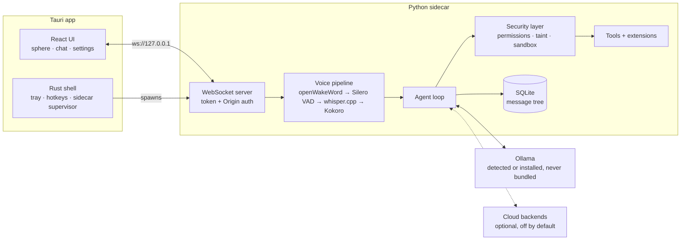

# Architecture

> Status: approved design, pre-implementation. Diagram to be refined as code lands.

## Load-bearing decisions

- **One ML runtime story**: onnxruntime (wake word, VAD, Kokoro) + whisper.cpp (Metal/CUDA/CPU). No PyTorch, no ctranslate2.
- **Sidecar is PyInstaller onedir** (never onefile: slow starts, orphaned processes). Custom `.spec` in `scripts/`. Built and CI-verified from phase 1 because packaging is the schedule's biggest risk.
- **Every tool call passes through `security/`** — the registry enforces this structurally; tools cannot opt out. `Registry` takes its `Gate` as a constructor argument, so a registry without a security layer cannot be built, and `default_registry(gate)` has no default either. See [security-model.md](security-model.md).
- **Confirmation is a request the backend makes, never a claim the client makes.** `security/confirm.py` mints the correlation id, broadcasts to every connection, and treats every way of not getting an answer — no UI, failed send, timeout, its own failure — as a deny. There is no client message that approves something out of nowhere, which is what lets the dialog live in the webview (an in-app modal, per §1's amendment) without the webview being trusted. "Allow for this session" is tool + exact arguments, memory-only, never for `dangerous`.
- **Messages are an immutable tree** (`parent_id`, turn-grouped so tool-call spans branch atomically). Branching UI comes later; the schema is branching-ready from day 1 because retrofitting immutability is the expensive part. **Scope of the promise:** no turn or message is ever rewritten or selectively removed — editing means appending a sibling turn and moving the active leaf. The one deletion that exists is `Store.delete_conversation()`, which drops a whole conversation *container* and everything under it. That is user control over their own data, not a mutation of history: a conversation is either wholly present or wholly gone. Because the FKs carry no `ON DELETE CASCADE` (and `CREATE TABLE IF NOT EXISTS` + no migration framework means they never will), it deletes messages → turns → conversation inside one transaction.
- **RAM tiers**: ≤8GB → 3B-class, 16GB → 7-8B, 32GB+ → 14B+. The 8GB tier is the one we polish hardest. The budget answers "can this machine run it *well*", so auto-selection also skips catalog-tagged **reasoning** models: their thinking pass lands entirely before the first content token (qwen3:4b measures 20s on the 8GB M2 against a ~0.65s LLM-leg budget), which the RAM budget cannot see because the cost is time, not memory. An explicitly configured model is always honoured. See [tool-calling.md](tool-calling.md).
- **Latency metric**: *end of user speech → first audio*. Targets: <1.5s (8GB/3B), <2s (16GB/7B). Budget breakdown: [latency.md](latency.md).
- **Barge-in tiers**: v1 default = wake-word + hotkey interrupt; opt-in full VAD barge-in (headphones/beamforming-mic warning); proper AEC (macOS Voice Processing AU, then WebRTC AEC3) is its own post-v1 milestone.

## Phases (sequencing, not deadlines)

1. **Walking skeleton** — Tauri + sidecar handshake, streaming text chat vs Ollama, SQLite tree schema, tray, `jarvis doctor` v0, **CI producing installable artifacts on all 3 platforms**
2. **Voice loop** — PTT → VAD → whisper.cpp → LLM → chunked Kokoro playback, latency instrumentation wired into doctor
3. **Always-on + feel** — wake word, wake-word barge-in, sphere states, RAM tiering, onboarding v1
4. **Agency + security** — permission engine, taint, sandboxed tools, extension loader + approval (tools ship *with* their security layer, never before it)
5. **Extended scope** — branching UI, `jarvis install`, model catalog UI, default extensions, wake-word training tool + "Hey Friday", opt-in VAD barge-in
6. **Ship** — installers, onboarding polish, docs, tagged unsigned release
- **Post-v1**: AEC milestone, voice cloning TTS backend evaluation (Chatterbox-Turbo tier), auto-update (blocked on signing budget)

## Handshake reliability rules (phase-1 postmortem)

The "Backend didn't start in time" bug (missing Tauri capabilities → `event.listen`
silently denied) produced these standing rules, enforced in code:

1. `app/src-tauri/capabilities/default.json` grants `core:default` to the main
   window. Deleting it breaks all webview IPC events silently — don't.
2. Frontend handshake ([ipc.ts](../app/src/lib/ipc.ts)): listeners register
   BEFORE state queries, and `backend_info` is ALSO polled — events are an
   optimization, never a single point of failure.
3. No swallowed rejections anywhere in the spawn/handshake/connect chain;
   every step logs (Rust `[sidecar]`, webview via the `frontend_log` command,
   raw sidecar stdout behind `JARVIS_DEBUG=1`).
4. `JARVIS_STARTUP_DELAY=<s>` (backend test hook) simulates a slow cold start;
   any change to the handshake must pass a run with `JARVIS_STARTUP_DELAY=5`.

## Followups

- Sidecar auto-restart with backoff on unexpected exit (today: UI shows
  "backend stopped", user restarts the app).
- `ws.ts` keeps reconnect-looping against a dead port after `backend-exited`
  (harmless noise; suppress once auto-restart exists).
- macOS Intel (`x86_64-apple-darwin`) release target — add a `macos-13` runner
  to release.yml if anyone asks for it.
